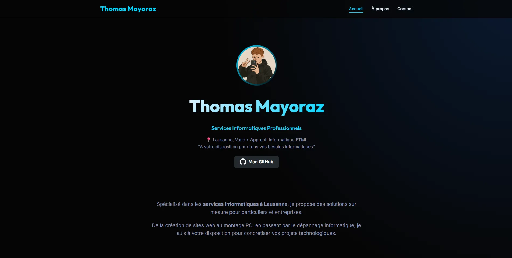

<div align="center">
  
  <h1>Portfolio & Services Informatiques - Thomas Mayoraz</h1>
  <p>Mon portfolio personnel et vitrine de mes services informatiques en région lausannoise.</p>
  
  <p>
    <a href="https://mayoraz-net.ch">🌐 Visiter le site web</a>
    ·
    <a href="https://github.com/Tom1419-git/mayoraz-net/issues">🐛 Signaler un bug</a>
  </p>
</div>

<br/>

<!-- Remplacer le lien de l'image ci-dessous par une vraie capture d'écran une fois ajoutée au projet -->
<div align="center">
  
</div>

<br/>

## 🚀 À propos du projet

Ce projet est le code source de mon site personnel et portfolio professionnel. Il présente mes compétences, mes projets en tant qu'Apprenti Informatique à l'ETML, ainsi que les différents services informatiques que je propose aux particuliers et entreprises de la région de Lausanne.

### ✨ Fonctionnalités clés
* **Design moderne** : Interface sombre (Dark mode), design responsive, et animations fluides.
* **Portfolio intégré** : Présentation détaillée de mes projets personnels et scolaires.
* **Formulaire de contact sécurisé** : Protection anti-spam propulsée par Cloudflare Turnstile intégrée au frontend, avec soumission AJAX via Formspree.
* **SEO optimisé** : Balises Open Graph pour le partage sur les réseaux sociaux et sitemap XML.

## 🛠️ Technologies Utilisées

* **Frontend** : HTML5, CSS3 (Custom Variables, Flexbox, Grid), JavaScript (Vanilla)
* **Polices & Icônes** : Google Fonts (Inter)
* **Sécurité** : Cloudflare Turnstile
* **Hébergement** : GitHub Pages
* **Backend de messagerie** : Formspree

## 📂 Structure du projet

```text
├── index.html              # Page d'accueil (Services & Contact)
├── a-propos/
│   └── index.html          # Présentation de mon parcours et CV
├── contact/
│   ├── index.html          # Formulaire de contact sécurisé
│   └── merci.html          # Page de confirmation d'envoi
├── media/
│   ├── css/                # Feuilles de style (main.css, contact.css)
│   ├── img/                # Images, photos de profil et logos
│   └── js/                 # Scripts interactifs et protection
└── sitemap.xml             # Fichier de mapping pour les moteurs de recherche
```

## 📬 Me contacter

* **Email professionnel** : [contact@mayoraz-net.ch](mailto:contact@mayoraz-net.ch)
* **Site web** : [mayoraz-net.ch](https://mayoraz-net.ch)
* **GitHub** : [@Tom1419-git](https://github.com/Tom1419-git)

---

<div align="center">
  <i>Développé avec passion par Thomas Mayoraz &copy; 2026</i>
</div>
